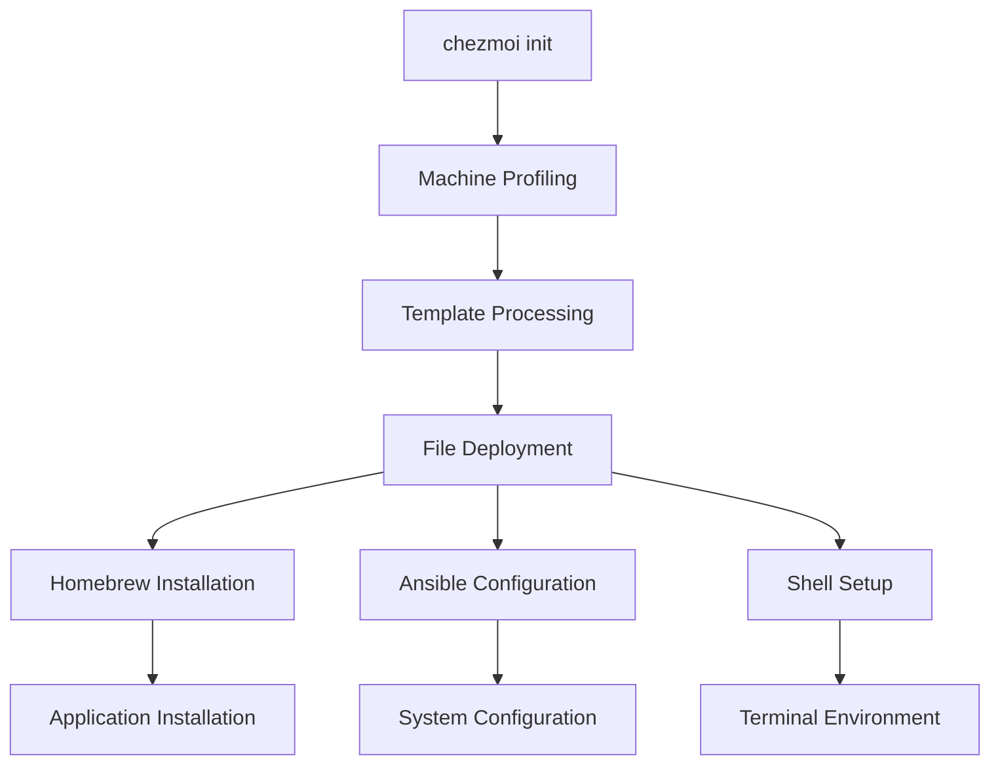

# System Architecture

## Overview

The macOS configuration management system uses a layered architecture built on chezmoi's templating engine, with Ansible handling system configuration and Homebrew managing package installation. The system is designed around conditional configuration based on interactive machine profiling.

## Core Architecture Layers

### 1. Configuration Management Layer (chezmoi)
- **Primary tool**: chezmoi dotfiles manager
- **Function**: Template processing, file deployment, and state management
- **Key files**:
  - [`.chezmoi.toml.tmpl`](.chezmoi.toml.tmpl) - Machine profiling and data collection
  - [`dot_*`](.) files - Dotfiles with conditional templating
  - [`.chezmoiexternal.toml`](.chezmoiexternal.toml) - External repository management
  - [`.chezmoiignore`](.chezmoiignore) - File exclusion rules

### 2. Package Management Layer (Homebrew)
- **Primary tool**: Homebrew with template-driven Brewfiles
- **Function**: Conditional software installation based on machine profile
- **Key files**:
  - [`dot_Brewfile.tmpl`](dot_Brewfile.tmpl) - Template-driven package definitions
  - [`run_onchange_homebrew.sh.tmpl`](run_onchange_homebrew.sh.tmpl) - Automated installation script

### 3. System Configuration Layer (Ansible)
- **Primary tool**: Ansible playbooks for macOS system settings
- **Function**: Configure macOS preferences, UI settings, and system behavior
- **Key files**:
  - [`dot_local/share/macos-setup/main.ansible.yml`](dot_local/share/macos-setup/main.ansible.yml) - Main orchestration playbook
  - [`dot_local/share/macos-setup/macos/`](dot_local/share/macos-setup/macos/) - Modular configuration playbooks
  - [`run_onchange_macos-setup.sh.tmpl`](run_onchange_macos-setup.sh.tmpl) - Ansible execution trigger

### 4. Shell Environment Layer
- **Primary tools**: Zsh + Oh My Zsh + Starship
- **Function**: Terminal environment, prompt, and shell enhancements
- **Key files**:
  - [`dot_zshrc`](dot_zshrc) - Zsh configuration with plugin management
  - [`dot_config/starship.toml`](dot_config/starship.toml) - Shell prompt configuration
  - [`.chezmoiexternal.toml`](.chezmoiexternal.toml) - Oh My Zsh plugin management

## Machine Profiling System

### Profile Variables
The system uses four boolean variables to determine machine configuration:
- `personal` - Personal applications and settings
- `developer` - Development tools and environment
- `macosSetup` - System configuration via Ansible
- `local` - Local configurations for local or specific needs

### Profile Combinations
Supported profile combinations:
- **Personal only**: Basic personal machine with minimal tools
- **Developer only**: Development-focused machine without personal apps
- **Personal + Developer**: Full-featured personal development machine
- **Local variations**: Any combination with local-specific additions

### Template Logic
Templates use Go template syntax for conditional configuration:
```go
{{- if eq .developer "true" }}
# Development-specific configuration
{{- end }}

{{- if (and (eq .personal "true") (eq .developer "true")) }}
# Combined personal + development configuration
{{- end }}
```

## Component Relationships

### Initialization Flow
1. **chezmoi init**: Triggers machine profiling prompts
2. **Profile storage**: Variables stored in `.chezmoi.toml.tmpl`
3. **Template processing**: All `.tmpl` files processed with profile data
4. **File deployment**: Processed files deployed to target locations
5. **Script execution**: `run_onchange_*` scripts execute based on file changes

### Dependency Chain


## Key Design Patterns

### 1. Template-Driven Configuration
- All configuration files use `.tmpl` extension for conditional processing
- Profile variables drive template logic
- Hash-based change detection triggers script execution

### 2. Modular System Configuration
- Ansible playbooks split by functional area (Finder, Dock, Safari, etc.)
- Each module can be independently maintained and updated
- Conditional execution based on `become_active` variable

### 3. External Dependency Management
- Oh My Zsh and plugins managed via `.chezmoiexternal.toml`
- LazyVim cloned via `run_once_before-config-nvim.lua.tmpl`
- Git repositories automatically updated and maintained

### 4. Security Integration
- 1Password CLI integration for credential management
- SSH agent configuration for secure authentication
- GPG signing setup for Git commits

## Critical Implementation Paths

### Package Installation Path
1. [`dot_Brewfile.tmpl`](dot_Brewfile.tmpl) - Defines packages based on profile
2. [`run_onchange_homebrew.sh.tmpl`](run_onchange_homebrew.sh.tmpl) - Executes `brew bundle`
3. Hash-based change detection ensures updates when Brewfile changes

### System Configuration Path
1. [`run_onchange_macos-setup.sh.tmpl`](run_onchange_macos-setup.sh.tmpl) - Triggers Ansible
2. [`dot_local/share/macos-setup/main.ansible.yml`](dot_local/share/macos-setup/main.ansible.yml) - Main playbook
3. Modular playbooks in [`dot_local/share/macos-setup/macos/`](dot_local/share/macos-setup/macos/)
4. Process restart tasks ensure settings take effect

### Development Environment Path
1. [`run_once_before-config-nvim.lua.tmpl`](run_once_before-config-nvim.lua.tmpl) - LazyVim setup
2. [`dot_zshrc`](dot_zshrc) - Shell configuration
3. [`.chezmoiexternal.toml`](.chezmoiexternal.toml) - Plugin management
4. [`dot_config/starship.toml`](dot_config/starship.toml) - Prompt configuration

## Extensibility Points

### Adding New Profiles
- Extend [`.chezmoi.toml.tmpl`](.chezmoi.toml.tmpl) with new prompt variables
- Add conditional logic to relevant template files
- Update [`dot_Brewfile.tmpl`](dot_Brewfile.tmpl) for profile-specific packages

### Adding New System Configurations
- Create new Ansible playbook in [`dot_local/share/macos-setup/macos/`](dot_local/share/macos-setup/macos/)
- Include in [`dot_local/share/macos-setup/macos/main.ansible.yml`](dot_local/share/macos-setup/macos/main.ansible.yml)
- Follow existing pattern for process restart if needed

### Adding New Applications
- Add to appropriate profile section in [`dot_Brewfile.tmpl`](dot_Brewfile.tmpl)
- Consider configuration files that may need templating
- Add any required post-installation setup scripts
